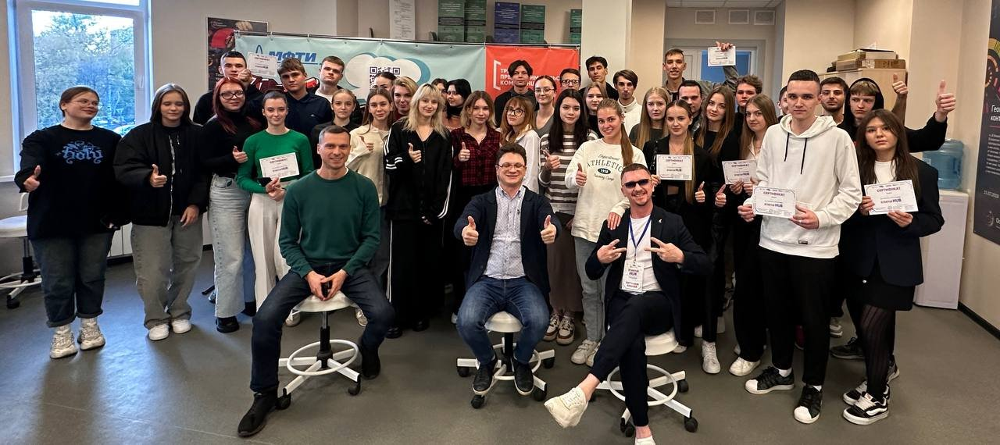
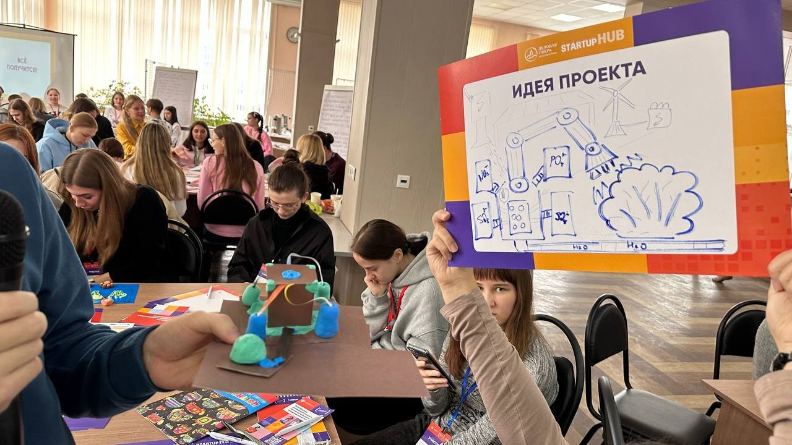
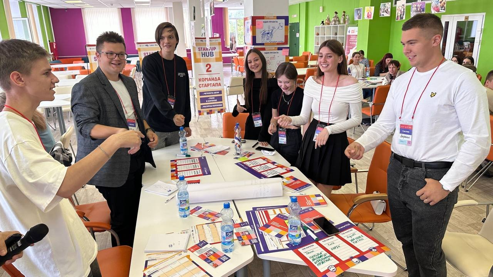

# Отчёт о взаимодействии с организацией-партнёром

## STARTUP HUB — Образовательная программа по предпринимательству

**Организатор:** ООО «Центр развития бизнеса «Деловая сфера»  
**Место проведения:** Московский Политехнический Университет, г. Москва, ул. Прянишникова, д. 2А, каб. ПР-1211  
**Дата:** 15 мая 2026 г.  
**Участники от группы 251-335:**
- Журакулов Саидкамол Улмасжон угли
- Аширматов Абдукодир Хотамович

---

## 1. Общая информация о мероприятии

STARTUP HUB — образовательная программа, направленная на формирование практических навыков поиска бизнес-идей, разработки и проверки бизнес-моделей, составления финансового плана и презентации проекта потенциальным инвесторам.

Программа проводилась совместно Московским Политехническим Университетом и ООО «Деловая сфера» в рамках взаимодействия студентов с организациями-партнёрами в ходе проектной (учебной) практики.

---

## 2. Программа мероприятия

### Такт 1. Тренинги предпринимательских компетенций

Каждый тренинг продолжительностью 45 минут был посвящён отдельному аспекту предпринимательской деятельности:

| № | Тренинг | Краткое содержание |
|---|---------|-------------------|
| 1 | Генерация и формирование продуктовых идей | Методики поиска идей, анализ рынка, выявление «болей» пользователей |
| 2 | Формирование команды стартапа | Роли в команде (Hustler, Hacker, Hipster), распределение ответственности |
| 3 | Разработка гипотез и MVP | Минимально жизнеспособный продукт, проверка гипотез, итерации |
| 4 | Организационная структура бизнес-проекта | Структура компании, процессы, масштабирование |
| 5 | Бизнес-модель стартапа | Canvas-модель, потоки доходов, ключевые партнёры |
| 6 | Презентация и переговоры с инвестором | Питч-структура, работа с возражениями, elevator pitch |

### Такт 2. Конвейер бизнес-идей

«Конвейер бизнес-идей» — технология создания, диагностики и улучшения бизнес-идеи. Тестирование проходило командно по 6 станциям:

1. **Станция 1 — Проблема и решение:** формулировка проблемы целевой аудитории и предлагаемого решения
2. **Станция 2 — Целевая аудитория:** определение портрета потенциального клиента
3. **Станция 3 — Конкуренты:** анализ существующих решений на рынке
4. **Станция 4 — MVP:** описание минимального продукта для проверки гипотезы
5. **Станция 5 — Монетизация:** выбор модели получения дохода
6. **Станция 6 — Команда:** оценка компетенций и ролей в команде

По итогам конвейера каждая команда получила табель оценки бизнес-идеи.

### Такт 3. Питч-сессия

Бизнес-идеи, набравшие наибольшее количество баллов по итогам конвейера, были представлены на защите перед потенциальными инвесторами. Продолжительность каждой защиты — 5 минут.

---

## 3. Личный опыт участия

### Журакулов Саидкамол Улмасжон угли

Участие в программе STARTUP HUB стало для меня первым опытом знакомства с предпринимательской средой. Наиболее полезными оказались тренинги по формированию команды стартапа и разработке MVP.

**Что узнал:**
- Как выявить реальную «боль» пользователя, а не придумать проблему
- Разница между ролями в стартапе: Hacker (технарь), Hustler (продажник), Hipster (дизайнер)
- Принцип «fail fast» — быстрая проверка гипотез вместо долгой разработки
- Как построить бизнес-модель по Canvas за 45 минут

**Связь с проектом:**  
Принципы MVP напрямую применимы к нашей образовательной платформе. Вместо того чтобы сразу строить полноценную систему, стоило начать с минимального набора функций — регистрация, один тип упражнений, базовый прогресс — и получить обратную связь от реальных пользователей. Именно так я подошёл к построению backend-архитектуры: сначала базовый API, затем постепенное расширение функциональности.

### Аширматов Абдукодир Хотамович

Программа помогла взглянуть на разработку продукта с бизнес-стороны, а не только с технической.

**Что узнал:**
- Важность понимания целевой аудитории до написания кода
- Как проводить проблемные интервью с пользователями
- Структура питча: проблема → решение → рынок → команда → финансы
- Почему красивый интерфейс без решения реальной проблемы не имеет ценности

**Связь с проектом:**  
В работе над Buddy я теперь понимаю, что дизайн интерфейса должен исходить из реальных потребностей иностранных студентов. Тренинг по целевой аудитории помог пересмотреть некоторые UI-решения и сделать интерфейс более интуитивным для пользователей, для которых русский язык не является родным.

---

## 4. Полученные знания и навыки

| Навык | Описание |
|-------|----------|
| Генерация идей | Методики брейнсторминга, SCAMPER, Jobs To Be Done |
| Командная работа | Распределение ролей, эффективное взаимодействие под давлением времени |
| Бизнес-моделирование | Построение Canvas-модели, анализ потоков доходов |
| Публичные выступления | Структура питча, работа с аудиторией инвесторов |
| Критическое мышление | Проверка гипотез, анализ конкурентов |

---

## 5. Связь с проектной деятельностью

Образовательная программа STARTUP HUB непосредственно связана с нашим проектом по дисциплине «Проектная деятельность». Принципы, полученные на тренингах, применимы к разработке образовательной платформы:

- **MVP-подход** → разработка ключевых функций платформы в первую очередь
- **Целевая аудитория** → фокус на реальных потребностях иностранных студентов
- **Бизнес-модель** → понимание ценностного предложения платформы
- **Командные роли** → чёткое разделение backend/frontend ответственности

---

## 6. Фотоматериалы

### Завершение программы — участники с сертификатами

*Участники образовательной программы STARTUP HUB после вручения сертификатов. Московский Политех, 15 мая 2026 г.*

### Конвейер бизнес-идей — работа над идеей проекта

*Этап «Конвейер бизнес-идей» — защита идеи проекта на станциях. Участники демонстрируют разработанную концепцию.*

### Тренинг «Команда стартапа» — распределение ролей

*Тренинг №2 «Формирование команды технологического стартапа». Участники обсуждают роли и ресурсы команды.*

---

## 7. Заключение

Участие в программе STARTUP HUB стало ценным опытом выхода за рамки технической разработки. Мы получили практические инструменты для оценки жизнеспособности продуктовых идей, навыки командной работы в условиях ограниченного времени и понимание того, как технические решения должны быть направлены на решение реальных бизнес-задач.

Полученный опыт дополняет техническую составляющую нашей проектной практики и формирует более целостный взгляд на процесс создания цифровых продуктов — от идеи до реализации и представления инвесторам.

---

**Сертификаты:**
- [Сертификат — Журакулов Саидкамол Улмасжон угли](../site/img/cert1.pdf)
- [Сертификат — Аширматов Абдукодир Хотамович](../site/img/cert2.pdf)

---

*Отчёт подготовлен: Журакулов С.У., Аширматов А.Х.*  
*Группа 251-335 · Московский Политехнический Университет · 2026*