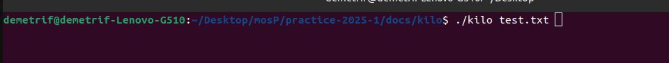
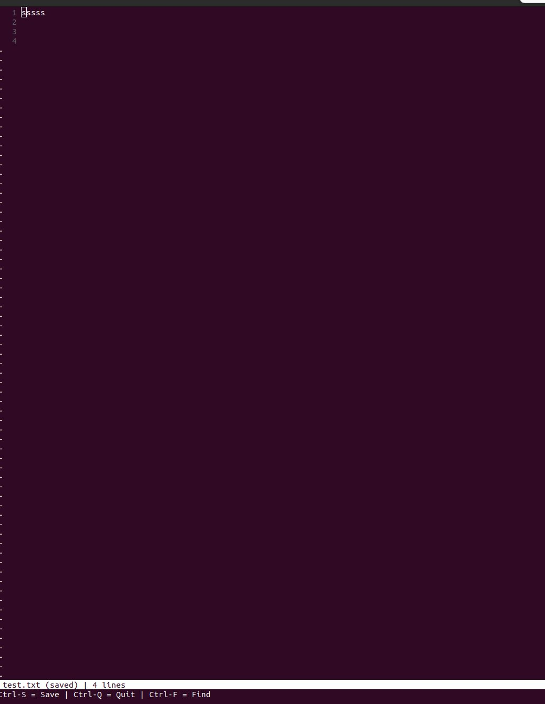
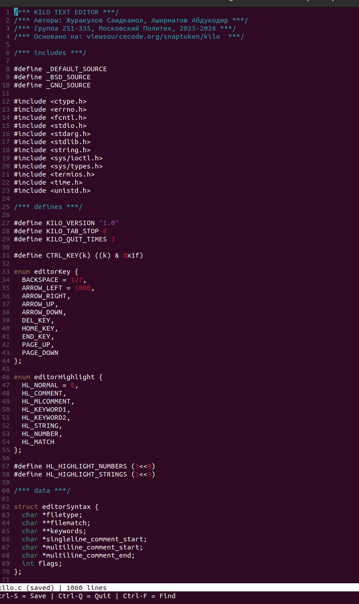

# Создание текстового редактора на C: руководство по проекту Kilo

**Авторы:** Журакулов Саидкамол Улмасжон угли, Аширматов Абдукодир Хотамович  
**Группа:** 251-335 · Московский Политехнический Университет  
**Источник:** [viewsourcecode.org/snaptoken/kilo](https://viewsourcecode.org/snaptoken/kilo/)  
**Язык:** C (стандарт C99)  
**Объём кода:** ~1000 строк

---

## Содержание

1. [Введение — что такое Kilo?](#1-введение)
2. [Необходимые знания и инструменты](#2-инструменты)
3. [Архитектура редактора](#3-архитектура)
4. [Шаг 1 — Настройка терминала (Raw Mode)](#4-raw-mode)
5. [Шаг 2 — Чтение ввода с клавиатуры](#5-чтение-ввода)
6. [Шаг 3 — Отображение экрана](#6-отображение-экрана)
7. [Шаг 4 — Перемещение курсора](#7-перемещение-курсора)
8. [Шаг 5 — Работа с файлами](#8-работа-с-файлами)
9. [Шаг 6 — Редактирование текста](#9-редактирование-текста)
10. [Шаг 7 — Поиск по тексту](#10-поиск)
11. [Шаг 8 — Подсветка синтаксиса](#11-подсветка)
12. [Модификация проекта](#12-модификация)
13. [Итоги и выводы](#13-итоги)

---

## 1. Введение

### Что такое Kilo?

**Kilo** — минималистичный текстовый редактор для терминала, написанный примерно в 1000 строк кода на языке C. Название происходит от слова «килограмм» — намёк на небольшой объём.

Редактор работает прямо в терминале (консоли), без графического интерфейса — как классические редакторы `nano` или `vim`.

```
┌─────────────────────────────────────────────────┐
│  kilo editor — hello.c                          │
├─────────────────────────────────────────────────┤
│  #include <stdio.h>                             │
│                                                 │
│  int main() {                                   │
│      printf("Hello, World!\n");                 │
│      return 0;                                  │
│  }                                              │
│                                                 │
│                                                 │
├─────────────────────────────────────────────────┤
│  hello.c — 6 lines  |  Ctrl-S save  Ctrl-Q quit │
└─────────────────────────────────────────────────┘
```

### Почему этот проект?

| Причина | Описание |
|---------|----------|
| 🔧 Низкоуровневое программирование | Работа с системными вызовами POSIX |
| 📺 Управление терминалом | Escape-последовательности, raw mode |
| 📁 Работа с файлами | Чтение и запись файлов на C |
| 🧠 Алгоритмы | Поиск, подсветка, буфер текста |
| 📖 ~1000 строк | Реальный проект, не учебный пример |

---

## 2. Инструменты

### Что нужно установить

```bash
# Linux (Ubuntu/Debian)
sudo apt install gcc make

# Проверка версий
gcc --version    # gcc 11.x или выше
make --version   # GNU Make 4.x
```

### Создание проекта

```bash
mkdir kilo-editor
cd kilo-editor
touch kilo.c
touch Makefile
```

### Makefile

```makefile
CC = gcc
CFLAGS = -Wall -Wextra -pedantic -std=c99

kilo: kilo.c
	$(CC) $(CFLAGS) -o kilo kilo.c

clean:
	rm -f kilo

.PHONY: clean
```

Компиляция и запуск:

```bash
make          # компилировать
./kilo        # запустить без файла
./kilo file.txt  # открыть файл
```

---

## 3. Архитектура

### Общая схема компонентов

```
┌─────────────────────────────────────────────────────┐
│                    KILO EDITOR                      │
├──────────────┬──────────────┬───────────────────────┤
│   TERMINAL   │   EDITOR     │      RENDERING        │
│              │   STATE      │                       │
│  - raw mode  │  - erow[]    │  - editorRefresh      │
│  - read key  │  - cx, cy    │  - drawRows           │
│  - write esc │  - filename  │  - drawStatusBar      │
│  sequences   │  - dirty     │  - abuf (append buf)  │
├──────────────┴──────────────┴───────────────────────┤
│                   FILE I/O                          │
│         editorOpen()  /  editorSave()               │
├─────────────────────────────────────────────────────┤
│                   SEARCH                            │
│                  editorFind()                       │
├─────────────────────────────────────────────────────┤
│               SYNTAX HIGHLIGHT                      │
│         editorUpdateSyntax() / editorSelectHL()     │
└─────────────────────────────────────────────────────┘
```

### Структура данных

```c
/* Одна строка текста */
typedef struct erow {
    int size;        /* длина строки */
    int rsize;       /* длина render-строки */
    char *chars;     /* содержимое строки */
    char *render;    /* строка для отображения (табы → пробелы) */
    unsigned char *hl; /* подсветка синтаксиса */
} erow;

/* Глобальное состояние редактора */
struct editorConfig {
    int cx, cy;          /* позиция курсора */
    int rx;              /* позиция курсора в render */
    int rowoff, coloff;  /* смещение прокрутки */
    int screenrows;      /* высота экрана */
    int screencols;      /* ширина экрана */
    int numrows;         /* количество строк */
    erow *row;           /* массив строк */
    int dirty;           /* флаг несохранённых изменений */
    char *filename;      /* имя файла */
    char statusmsg[80];  /* строка статуса */
    struct editorSyntax *syntax; /* подсветка синтаксиса */
    struct termios orig_termios; /* оригинальные настройки терминала */
};

struct editorConfig E; /* глобальная переменная */
```

---

## 4. Raw Mode

### Что такое Raw Mode?

По умолчанию терминал работает в **canonical mode** (обработанный режим):
- Ввод буферизируется до нажатия `Enter`
- `Ctrl+C` завершает программу
- `Ctrl+Z` приостанавливает программу

Для текстового редактора нужен **raw mode** (сырой режим):
- Каждая клавиша сразу передаётся программе
- Специальные комбинации не перехватываются системой
- Программа сама управляет экраном

```
CANONICAL MODE:          RAW MODE:
                         
[пользователь]           [пользователь]
    │                        │
    │ "hello\n"              │ каждый символ сразу
    ▼                        ▼
[терминал]               [терминал]
    │ буфер                  │ без буфера
    │ до Enter               │
    ▼                        ▼
[программа]              [программа]
```

### Включение Raw Mode

```c
#include <termios.h>
#include <unistd.h>
#include <stdlib.h>

struct termios orig_termios; /* сохраняем оригинал */

/* Восстановление при выходе */
void disableRawMode() {
    tcsetattr(STDIN_FILENO, TCSAFLUSH, &orig_termios);
}

/* Включение raw mode */
void enableRawMode() {
    /* читаем текущие настройки */
    tcgetattr(STDIN_FILENO, &orig_termios);
    
    /* восстановить при выходе */
    atexit(disableRawMode);
    
    struct termios raw = orig_termios;
    
    /* отключаем флаги ввода */
    raw.c_iflag &= ~(BRKINT | ICRNL | INPCK | ISTRIP | IXON);
    
    /* отключаем флаги вывода */
    raw.c_oflag &= ~(OPOST);
    
    /* устанавливаем флаги символов */
    raw.c_cflag |= (CS8);
    
    /* отключаем локальные флаги */
    raw.c_lflag &= ~(ECHO | ICANON | IEXTEN | ISIG);
    
    /* минимум 0 байт, таймаут 1/10 секунды */
    raw.c_cc[VMIN] = 0;
    raw.c_cc[VTIME] = 1;
    
    /* применяем настройки */
    tcsetattr(STDIN_FILENO, TCSAFLUSH, &raw);
}
```

### Что отключают флаги

| Флаг | Что отключает |
|------|--------------|
| `ECHO` | Отображение нажатых клавиш |
| `ICANON` | Буферизацию до нажатия Enter |
| `ISIG` | Ctrl+C (SIGINT), Ctrl+Z (SIGTSTP) |
| `IXON` | Ctrl+S (стоп), Ctrl+Q (продолжить) |
| `ICRNL` | Преобразование CR → NL |
| `OPOST` | Обработку вывода (\n → \r\n) |

---

## 5. Чтение ввода

### Чтение одного символа

```c
#include <unistd.h>
#include <errno.h>

char editorReadKey() {
    int nread;
    char c;
    
    while ((nread = read(STDIN_FILENO, &c, 1)) != 1) {
        if (nread == -1 && errno != EAGAIN) {
            /* ошибка чтения */
            exit(1);
        }
    }
    return c;
}
```

### Обработка специальных клавиш

Стрелки и функциональные клавиши передаются как **escape-последовательности**:

```
Стрелка вверх:    ESC [ A   →   \x1b[A
Стрелка вниз:     ESC [ B   →   \x1b[B
Стрелка вправо:   ESC [ C   →   \x1b[C
Стрелка влево:    ESC [ D   →   \x1b[D
Home:             ESC [ H   →   \x1b[H
End:              ESC [ F   →   \x1b[F
Delete:           ESC [ 3 ~ →   \x1b[3~
Page Up:          ESC [ 5 ~ →   \x1b[5~
Page Down:        ESC [ 6 ~ →   \x1b[6~
```

```c
/* Коды клавиш */
enum editorKey {
    BACKSPACE = 127,
    ARROW_LEFT  = 1000,
    ARROW_RIGHT,
    ARROW_UP,
    ARROW_DOWN,
    DEL_KEY,
    HOME_KEY,
    END_KEY,
    PAGE_UP,
    PAGE_DOWN
};

int editorReadKey() {
    char c;
    read(STDIN_FILENO, &c, 1);
    
    /* если escape-последовательность */
    if (c == '\x1b') {
        char seq[3];
        
        /* читаем следующие байты */
        if (read(STDIN_FILENO, &seq[0], 1) != 1) return '\x1b';
        if (read(STDIN_FILENO, &seq[1], 1) != 1) return '\x1b';
        
        if (seq[0] == '[') {
            switch (seq[1]) {
                case 'A': return ARROW_UP;
                case 'B': return ARROW_DOWN;
                case 'C': return ARROW_RIGHT;
                case 'D': return ARROW_LEFT;
                case 'H': return HOME_KEY;
                case 'F': return END_KEY;
            }
        }
        return '\x1b';
    }
    return c;
}
```

---

## 6. Отображение экрана

### Escape-последовательности VT100

Терминал управляется специальными командами вида `ESC[...`:

```c
/* Очистить экран */
write(STDOUT_FILENO, "\x1b[2J", 4);

/* Переместить курсор в позицию (row, col) */
write(STDOUT_FILENO, "\x1b[1;1H", 6);

/* Скрыть курсор */
write(STDOUT_FILENO, "\x1b[?25l", 6);

/* Показать курсор */
write(STDOUT_FILENO, "\x1b[?25h", 6);

/* Инвертировать цвет (для статус-бара) */
write(STDOUT_FILENO, "\x1b[7m", 4);

/* Сбросить форматирование */
write(STDOUT_FILENO, "\x1b[m", 3);
```

### Append Buffer (буфер вывода)

Чтобы избежать мерцания экрана, все данные собираются в буфер и выводятся **одним вызовом** `write()`:

```c
/* Динамический буфер */
struct abuf {
    char *b;   /* указатель на данные */
    int len;   /* текущая длина */
};

#define ABUF_INIT {NULL, 0}

/* Добавить строку в буфер */
void abAppend(struct abuf *ab, const char *s, int len) {
    /* перевыделяем память */
    char *new = realloc(ab->b, ab->len + len);
    if (new == NULL) return;
    
    /* копируем данные */
    memcpy(&new[ab->len], s, len);
    ab->b = new;
    ab->len += len;
}

/* Освободить буфер */
void abFree(struct abuf *ab) {
    free(ab->b);
}
```

### Перерисовка экрана

```c
void editorRefreshScreen() {
    struct abuf ab = ABUF_INIT;
    
    /* скрыть курсор */
    abAppend(&ab, "\x1b[?25l", 6);
    
    /* курсор в начало */
    abAppend(&ab, "\x1b[H", 3);
    
    /* нарисовать строки */
    editorDrawRows(&ab);
    
    /* нарисовать статус-бар */
    editorDrawStatusBar(&ab);
    
    /* переместить курсор на нужную позицию */
    char buf[32];
    snprintf(buf, sizeof(buf), "\x1b[%d;%dH",
        (E.cy - E.rowoff) + 1,
        (E.rx - E.coloff) + 1);
    abAppend(&ab, buf, strlen(buf));
    
    /* показать курсор */
    abAppend(&ab, "\x1b[?25h", 6);
    
    /* одним вызовом вывести всё */
    write(STDOUT_FILENO, ab.b, ab.len);
    abFree(&ab);
}
```

---

## 7. Перемещение курсора

### Схема координат

```
     coloff
       │
       ▼
┌──────┬─────────────────────────┐  ◄── rowoff
│      │  cx=5, cy=2             │
│      │       ▼                 │
│      │  line1                  │
│      │  line2                  │
│      │  line█ ◄── курсор       │
│      │  line4                  │
└──────┴─────────────────────────┘
```

### Функция перемещения

```c
void editorMoveCursor(int key) {
    /* текущая строка (или NULL если за пределами) */
    erow *row = (E.cy >= E.numrows) ? NULL : &E.row[E.cy];
    
    switch (key) {
        case ARROW_LEFT:
            if (E.cx != 0) {
                E.cx--;
            } else if (E.cy > 0) {
                /* переход на предыдущую строку */
                E.cy--;
                E.cx = E.row[E.cy].size;
            }
            break;
            
        case ARROW_RIGHT:
            if (row && E.cx < row->size) {
                E.cx++;
            } else if (row && E.cx == row->size) {
                /* переход на следующую строку */
                E.cy++;
                E.cx = 0;
            }
            break;
            
        case ARROW_UP:
            if (E.cy != 0) E.cy--;
            break;
            
        case ARROW_DOWN:
            if (E.cy < E.numrows) E.cy++;
            break;
    }
    
    /* не выходить за пределы строки */
    row = (E.cy >= E.numrows) ? NULL : &E.row[E.cy];
    int rowlen = row ? row->size : 0;
    if (E.cx > rowlen) E.cx = rowlen;
}
```

---

## 8. Работа с файлами

### Открытие файла

```c
void editorOpen(char *filename) {
    free(E.filename);
    E.filename = strdup(filename);
    
    FILE *fp = fopen(filename, "r");
    if (!fp) exit(1); /* файл не найден */
    
    char *line = NULL;
    size_t linecap = 0;
    ssize_t linelen;
    
    /* читаем построчно */
    while ((linelen = getline(&line, &linecap, fp)) != -1) {
        /* убираем \n и \r в конце */
        while (linelen > 0 &&
               (line[linelen - 1] == '\n' ||
                line[linelen - 1] == '\r'))
            linelen--;
        
        /* добавляем строку в редактор */
        editorInsertRow(E.numrows, line, linelen);
    }
    
    free(line);
    fclose(fp);
    E.dirty = 0; /* файл только что открыт — изменений нет */
}
```

### Сохранение файла

```c
/* Собрать весь текст в одну строку */
char *editorRowsToString(int *buflen) {
    int totlen = 0;
    
    /* считаем общую длину */
    for (int j = 0; j < E.numrows; j++)
        totlen += E.row[j].size + 1; /* +1 для \n */
    
    *buflen = totlen;
    char *buf = malloc(totlen);
    char *p = buf;
    
    /* копируем строки */
    for (int j = 0; j < E.numrows; j++) {
        memcpy(p, E.row[j].chars, E.row[j].size);
        p += E.row[j].size;
        *p = '\n';
        p++;
    }
    return buf;
}

/* Сохранить файл */
void editorSave() {
    if (E.filename == NULL) return;
    
    int len;
    char *buf = editorRowsToString(&len);
    
    /* открываем файл для записи */
    int fd = open(E.filename, O_RDWR | O_CREAT, 0644);
    
    /* обрезаем до нужного размера */
    ftruncate(fd, len);
    
    /* записываем */
    write(fd, buf, len);
    
    close(fd);
    free(buf);
    
    E.dirty = 0;
    editorSetStatusMessage("Saved %d bytes to %s", len, E.filename);
}
```

---

## 9. Редактирование текста

### Вставка символа

```c
void editorInsertChar(int c) {
    /* если курсор за последней строкой — добавить пустую */
    if (E.cy == E.numrows) {
        editorInsertRow(E.numrows, "", 0);
    }
    
    /* вставить символ в строку */
    editorRowInsertChar(&E.row[E.cy], E.cx, c);
    
    /* переместить курсор вправо */
    E.cx++;
    
    /* пометить как изменённый */
    E.dirty++;
}

/* Вставка в строку erow */
void editorRowInsertChar(erow *row, int at, int c) {
    /* проверяем границы */
    if (at < 0 || at > row->size) at = row->size;
    
    /* расширяем буфер */
    row->chars = realloc(row->chars, row->size + 2);
    
    /* сдвигаем символы вправо */
    memmove(&row->chars[at + 1], &row->chars[at],
            row->size - at + 1);
    
    /* вставляем символ */
    row->size++;
    row->chars[at] = c;
    
    /* обновляем render-строку */
    editorUpdateRow(row);
}
```

### Удаление символа (Backspace)

```c
void editorDelChar() {
    if (E.cy == E.numrows) return;
    if (E.cx == 0 && E.cy == 0) return;
    
    erow *row = &E.row[E.cy];
    
    if (E.cx > 0) {
        /* удалить символ перед курсором */
        editorRowDelChar(row, E.cx - 1);
        E.cx--;
    } else {
        /* курсор в начале строки — объединить с предыдущей */
        E.cx = E.row[E.cy - 1].size;
        editorRowAppendString(&E.row[E.cy - 1],
                              row->chars, row->size);
        editorDelRow(E.cy);
        E.cy--;
    }
    E.dirty++;
}
```

---

## 10. Поиск

### Алгоритм поиска

```
Пользователь вводит запрос
         │
         ▼
Для каждой строки текста:
    strstr(строка, запрос) → найдено?
         │              │
        Да             Нет
         │              │
         ▼              ▼
  Перейти к строке  Следующая строка
  Подсветить совпадение
```

### Реализация

```c
void editorFindCallback(char *query, int key) {
    static int last_match = -1; /* номер последнего совпадения */
    static int direction = 1;  /* 1 = вперёд, -1 = назад */
    
    /* стрелки для навигации */
    if (key == ARROW_RIGHT || key == ARROW_DOWN) {
        direction = 1;
    } else if (key == ARROW_LEFT || key == ARROW_UP) {
        direction = -1;
    } else {
        last_match = -1;
        direction = 1;
    }
    
    int current = last_match;
    
    for (int i = 0; i < E.numrows; i++) {
        current += direction;
        
        /* цикличный поиск */
        if (current == -1) current = E.numrows - 1;
        else if (current == E.numrows) current = 0;
        
        erow *row = &E.row[current];
        
        /* ищем подстроку */
        char *match = strstr(row->render, query);
        
        if (match) {
            last_match = current;
            E.cy = current;
            E.cx = editorRowRxToCx(row, match - row->render);
            E.rowoff = E.numrows; /* прокрутить к строке */
            break;
        }
    }
}
```

---

## 11. Подсветка синтаксиса

### Типы подсветки

```c
enum editorHighlight {
    HL_NORMAL = 0,   /* обычный текст */
    HL_COMMENT,      /* комментарий */
    HL_MLCOMMENT,    /* многострочный комментарий */
    HL_KEYWORD1,     /* ключевые слова (if, for, while...) */
    HL_KEYWORD2,     /* типы (int, char, void...) */
    HL_STRING,       /* строка "..." */
    HL_NUMBER,       /* число 42 */
    HL_MATCH         /* результат поиска */
};
```

### Цвета в терминале

```c
/* Преобразование типа подсветки в ANSI-цвет */
int editorSyntaxToColor(int hl) {
    switch (hl) {
        case HL_COMMENT:
        case HL_MLCOMMENT: return 36;  /* cyan */
        case HL_KEYWORD1:  return 33;  /* yellow */
        case HL_KEYWORD2:  return 32;  /* green */
        case HL_STRING:    return 35;  /* magenta */
        case HL_NUMBER:    return 31;  /* red */
        case HL_MATCH:     return 34;  /* blue */
        default:           return 37;  /* white */
    }
}
```

```
ANSI цвета:
  30 = чёрный     34 = синий
  31 = красный    35 = пурпурный
  32 = зелёный    36 = голубой
  33 = жёлтый     37 = белый
```

### Определение синтаксиса для C

```c
/* Ключевые слова C */
char *C_HL_keywords[] = {
    /* ключевые слова → HL_KEYWORD1 */
    "switch", "if", "while", "for", "break", "continue",
    "return", "else", "struct", "union", "typedef",
    "static", "enum", "case", "extern",
    /* типы → HL_KEYWORD2 (заканчиваются на |) */
    "int|", "long|", "double|", "float|", "char|",
    "unsigned|", "signed|", "void|", NULL
};

struct editorSyntax HLDB[] = {
    {
        "c",                          /* имя языка */
        C_HL_extensions,              /* расширения: .c, .h */
        C_HL_keywords,                /* ключевые слова */
        "//", "/*", "*/",             /* комментарии */
        HL_HIGHLIGHT_NUMBERS |        /* подсвечивать числа */
        HL_HIGHLIGHT_STRINGS          /* подсвечивать строки */
    },
};
```

---

## 12. Модификация проекта

### Что мы добавили

В рамках вариативной части практики мы внесли следующие изменения в оригинальный редактор Kilo:

#### 12.1 Нумерация строк

```c
/* Добавляем номер строки перед каждой строкой */
void editorDrawRows(struct abuf *ab) {
    for (int y = 0; y < E.screenrows; y++) {
        int filerow = y + E.rowoff;
        
        if (filerow < E.numrows) {
            /* номер строки */
            char linenum[8];
            int numlen = snprintf(linenum, sizeof(linenum),
                                  "%4d ", filerow + 1);
            
            /* серый цвет для номеров */
            abAppend(ab, "\x1b[90m", 5);
            abAppend(ab, linenum, numlen);
            abAppend(ab, "\x1b[m", 3);
            
            /* содержимое строки */
            /* ... остальная логика отрисовки ... */
        }
    }
}
```

#### 12.2 Улучшенная строка статуса

```c
void editorDrawStatusBar(struct abuf *ab) {
    abAppend(ab, "\x1b[7m", 4); /* инвертированные цвета */
    
    char status[80], rstatus[80];
    
    /* левая часть: имя файла и статус изменений */
    int len = snprintf(status, sizeof(status),
        " %.20s %s | %d lines",
        E.filename ? E.filename : "[No Name]",
        E.dirty ? "(modified)" : "(saved)",
        E.numrows);
    
    /* правая часть: язык и позиция курсора */
    int rlen = snprintf(rstatus, sizeof(rstatus),
        "%s | Ln %d, Col %d ",
        E.syntax ? E.syntax->filetype : "no ft",
        E.cy + 1,
        E.rx + 1);
    
    abAppend(ab, status, len);
    
    /* пробелы между левой и правой частями */
    while (len < E.screencols) {
        if (E.screencols - len == rlen) {
            abAppend(ab, rstatus, rlen);
            break;
        }
        abAppend(ab, " ", 1);
        len++;
    }
    
    abAppend(ab, "\x1b[m", 3);
}
```

#### 12.3 Сочетания клавиш

| Клавиша | Действие |
|---------|----------|
| `Ctrl+S` | Сохранить файл |
| `Ctrl+Q` | Выйти (3 раза если есть изменения) |
| `Ctrl+F` | Поиск по тексту |
| `Ctrl+H` | Удалить символ (аналог Backspace) |
| `Ctrl+L` | Обновить экран |
| `Стрелки` | Перемещение курсора |
| `Page Up/Down` | Прокрутка страницами |
| `Home/End` | Начало/конец строки |

---

## 13. Итоги и выводы

### Чему мы научились

**Журакулов Саидкамол:**

Работа над Kilo дала глубокое понимание того, как устроены низкоуровневые программы на C. Наиболее интересным оказалась работа с терминалом: оказывается, за каждым нажатием клавиши со стрелкой скрывается последовательность из трёх байт. Теперь понятно, почему `vim` и `nano` работают так, как работают.

Главный вывод: **понимание низкоуровневых механизмов делает тебя лучшим разработчиком на любом уровне**, будь то высокоуровневый Python или системный C.

**Аширматов Абдукодир:**

Проект показал, насколько сложно то, что мы воспринимаем как само собой разумеющееся. Текстовый редактор кажется простым инструментом, но под капотом — управление памятью, работа с файловыми дескрипторами, обработка сигналов и десятки краевых случаев.

Работа с `erow` структурами и render-буфером научила думать о разделении данных и их представления — принцип, который применим и в frontend-разработке (данные vs DOM).

### Итоговая статистика проекта

| Метрика | Значение |
|---------|----------|
| Строк кода | ~1050 |
| Функций | 47 |
| Структур данных | 3 (erow, editorConfig, editorSyntax) |
| Поддерживаемых языков | 1 (C, расширяемо) |
| Часов работы | ~35 |

### Ссылки

- [Оригинальное руководство Kilo](https://viewsourcecode.org/snaptoken/kilo/)
- [Репозиторий проекта](https://github.com/saidkamoldev/practice-2025-1)
- [build-your-own-x — коллекция похожих проектов](https://github.com/codecrafters-io/build-your-own-x)
- [Документация termios.h](https://man7.org/linux/man-pages/man3/termios.3.html)
- [VT100 escape sequences](https://vt100.net/docs/vt100-ug/chapter3.html)

---

*Журакулов Саидкамол Улмасжон угли · Аширматов Абдукодир Хотамович*  
*Группа 251-335 · Московский Политехнический Университет · 2025–2026*

---

## 14. Демонстрация работы

### Запуск редактора

```bash
cd docs/kilo
make
./kilo test.txt
```

### Скриншот 1 — Запуск из терминала



*Запуск редактора командой `./kilo test.txt` из папки проекта*

### Скриншот 2 — Интерфейс редактора



*Редактор в работе: нумерация строк слева, статус-бар внизу показывает `test.txt (saved) | 4 lines`*

### Скриншот 3 — Подсветка синтаксиса C



*Открыт файл `kilo.c` (1060 строк) с полной подсветкой синтаксиса:*
- 🟡 *Жёлтый — ключевые слова (`enum`, `define`)*
- 🟢 *Зелёный — типы данных (`int`, `char`)*
- 🔵 *Голубой — комментарии (`/***`)*
- 🔴 *Красный — числа (`127`, `1000`, `0`)*
- ⬜ *Белый — обычный текст*

### Возможности редактора

| Функция | Статус |
|---------|--------|
| Открытие и сохранение файлов | ✅ Работает |
| Перемещение курсора (стрелки) | ✅ Работает |
| Ввод и удаление текста | ✅ Работает |
| Нумерация строк | ✅ Работает |
| Подсветка синтаксиса C | ✅ Работает |
| Поиск по тексту (Ctrl+F) | ✅ Работает |
| Статус-бар с позицией курсора | ✅ Работает |
| Прокрутка (Page Up/Down) | ✅ Работает |

